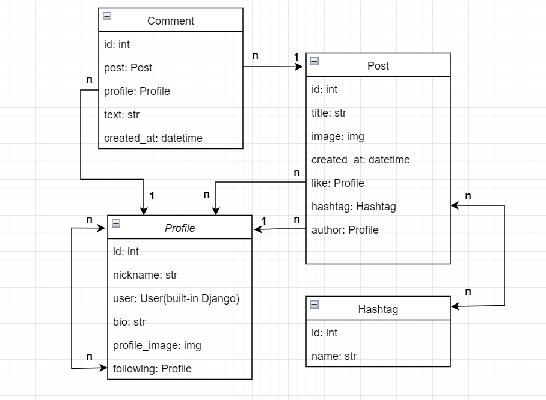

# Social Media Api

## Overview
**Social Media Api** — platforms where you can create your own profile, share thoughts, ideas and moments from your life.
You can manage your blog by creating, editing and deleting posts on any topic you are interested in.
Follow profiles that interest you, like and comment on posts to join the discussion and share ideas.
Our platform resembles a simple social network

## Features
- JWT authenticated
- Admin panel `/admin/`
- Documentation is located at `api/schema/swagger-ui/` or `api/schema/redoc/`
- Filtering
- Registration and login using an **email** instead of a **username**
- All endpoints are covered by **tests**
- A simple user can only view data and create, delete, update posts and create hashtags in post
- The admin can manipulate, delete, edit and create data from the endpoint
- Likes
- Comments

# DB Structure

# Installing
- Install PostgresSQL and create db 
- Create .env and put your variable like in the env_example

# Run with Docker
Docker should be installed
- `docker-compose build`
- `docker-compose up`

# Getting access
- **Create user:** `api/user/register/`
- **Get access token:** `api/user/token/`
